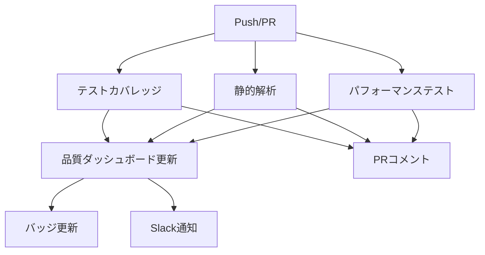

# 🛡️ CI/CD品質管理システム統合ガイド

## 概要

GitHub Actionsと品質ダッシュボードの統合により、自動的にコード品質を監視・改善するシステムを構築しました。

## 🚀 主要機能

### 自動品質チェック

- **テストカバレッジ**: Jest実行・結果レポート
- **静的解析**: ESLint + TypeScript型チェック
- **パフォーマンス**: Lighthouse分析
- **品質ゲート**: 自動合否判定

### 品質ダッシュボード

- **リアルタイム監視**: http://localhost:5173/quality-dashboard
- **トレンド分析**: 30日間の品質変化
- **改善提案**: 具体的なアクションアイテム

## 🔧 使用方法

### 開発環境での品質チェック

```bash
# 基本的な品質チェック
npm run quality:check

# 完全な品質分析（推奨）
npm run quality:full

# 問題の自動修正
npm run quality:fix

# Lighthouse パフォーマンステスト
npm run lighthouse:ci

# CI環境での完全テスト
npm run ci:quality
```

### コミット前チェック

```bash
# プリコミットフックが自動実行
git add .
git commit -m "feat: 新機能実装"

# または手動実行
npm run pre-commit
```

## 📊 品質メトリクス

### 品質ゲート基準

| メトリクス           | 基準値 | 重要度  |
| -------------------- | ------ | ------- |
| **テストカバレッジ** | ≥ 80%  | 🔴 必須 |
| **ESLintエラー**     | 0件    | 🔴 必須 |
| **TypeScriptエラー** | 0件    | 🔴 必須 |
| **パフォーマンス**   | ≥ 85点 | 🔴 必須 |
| **アクセシビリティ** | ≥ 90点 | 🟡 推奨 |

### スコア計算

```typescript
品質スコア = (
  テストカバレッジ×25% +
  コード品質×25% +
  パフォーマンス×25% +
  保守性×25%
)

コード品質 = max(0, 100 - ESLintエラー×10 - 警告×5)
保守性 = max(0, 100 - TypeScriptエラー×5)
```

## 🔄 GitHub Actions ワークフロー

### 自動実行タイミング

- **Push（main/develop）**: 全品質チェック実行
- **Pull Request**: カバレッジレポート自動コメント
- **定期実行**: 毎日午前9時（JST）
- **手動実行**: GitHub Actions画面から

### ワークフロー構成



## 📈 品質ダッシュボード活用

### 各タブの使い方

#### 1. **Overview（概要）**

- 全体品質スコア確認
- 品質ゲートステータス
- 最新の改善提案

#### 2. **Testing（テスト）**

- ファイル別カバレッジ詳細
- 未カバー箇所の特定
- テスト追加の優先順位

#### 3. **Static Analysis（静的解析）**

- ESLintエラー・警告一覧
- TypeScript型エラー詳細
- 修正方法の提案

#### 4. **Performance（パフォーマンス）**

- Lighthouse各スコア
- Core Web Vitals詳細
- 最適化提案

#### 5. **Trends（トレンド）**

- 30日間の品質変化
- 改善・劣化の傾向分析
- 目標達成状況

## 🎯 品質改善ガイド

### テストカバレッジ向上

```bash
# カバレッジレポート確認
npm run test:coverage:html
open coverage/lcov-report/index.html

# 不足箇所の特定
npm run test:coverage | grep -A 5 "Uncovered Line"
```

**優先順位:**

1. 🔴 **Critical**: 業務ロジック・API関数
2. 🟡 **High**: Reactコンポーネント
3. 🟢 **Medium**: ユーティリティ関数
4. ⚪ **Low**: 設定ファイル・定数

### ESLint エラー修正

```bash
# 自動修正可能なエラー
npm run lint:fix

# 手動修正が必要なエラー
npm run lint -- --format=table

# ルール別のエラー確認
npm run lint -- --format=stylish | grep -E "(error|warn)"
```

### パフォーマンス最適化

```bash
# Lighthouse レポート生成
npm run lighthouse:ci

# バンドルサイズ分析
npm run analyze
```

**改善項目:**

- 🚀 **JavaScript削減**: 動的インポート・Tree shaking
- 🖼️ **画像最適化**: WebP形式・遅延読み込み
- 🌐 **ネットワーク**: CDN・キャッシュ戦略
- 📱 **レンダリング**: 仮想化・メモ化

## 🔧 設定ファイル

### `.github/workflows/quality-check.yml`

CI/CDパイプラインの設定

### `lighthouserc.json`

Lighthouse分析設定

### `jest.config.js`

テスト・カバレッジ設定

### `eslint.config.js`

静的解析ルール設定

## 🚨 トラブルシューティング

### よくある問題

#### 1. GitHub Actions実行エラー

```bash
# ローカルでの事前確認
npm run ci:quality

# ログ確認
cat ~/.npm/_logs/*.log
```

#### 2. カバレッジ計測失敗

```bash
# Jest設定確認
npx jest --showConfig

# テスト実行詳細
npm test -- --verbose
```

#### 3. Lighthouse実行失敗

```bash
# 手動実行でのデバッグ
npm run build
npm run preview &
sleep 5
npx lhci collect --config=lighthouserc.json
```

#### 4. API通信エラー

```bash
# 品質APIエンドポイント確認
curl -X POST http://localhost:3000/api/quality/github-webhook \
  -H "Content-Type: application/json" \
  -d '{"test": true}'
```

## 📞 サポート

### エラー報告

GitHub Issues または Slack #dev-quality チャンネル

### 設定変更要求

PR作成または開発チームまでお問い合わせ

### 品質基準見直し

品質ゲート基準の変更は技術委員会で検討

---

## 🎉 品質向上のメリット

### 開発効率向上

- 🐛 **バグ削減**: 早期発見・修正
- 🚀 **デプロイ安全性**: 品質ゲートによる保証
- 📈 **技術債務削減**: 継続的改善

### チーム協働

- 👥 **コードレビュー効率化**: 自動チェックで焦点を明確化
- 📊 **可視化**: 品質状況の共有
- 🎯 **目標設定**: 具体的な改善目標

### ユーザー体験向上

- ⚡ **パフォーマンス**: 高速な動作
- 🛡️ **安定性**: エラー・クラッシュの削減
- ♿ **アクセシビリティ**: 誰もが使いやすいUI

**🚀 継続的な品質向上で、最高のプロダクトを構築しましょう！**
