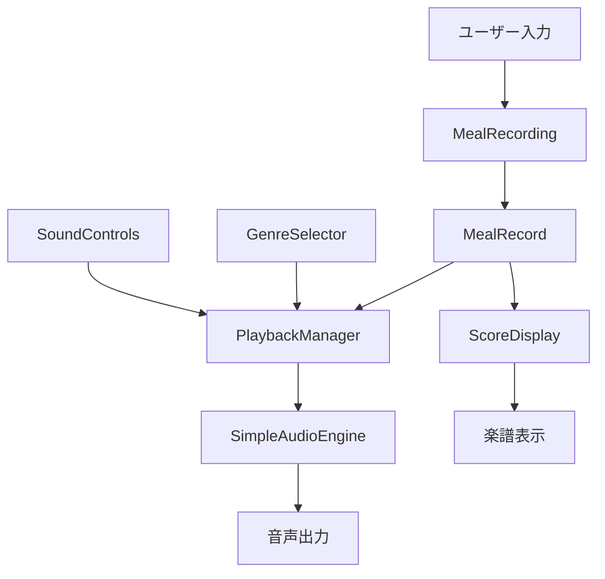
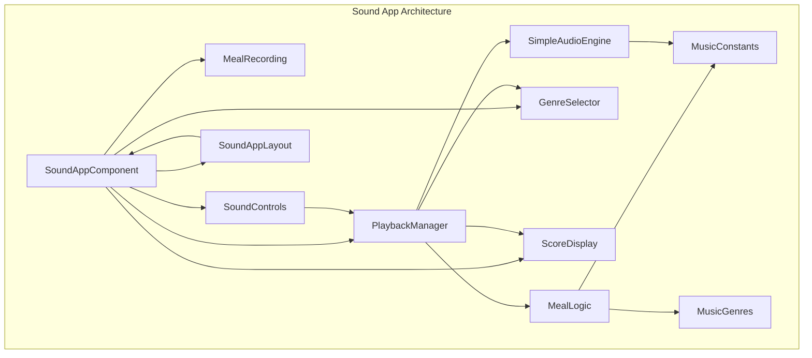
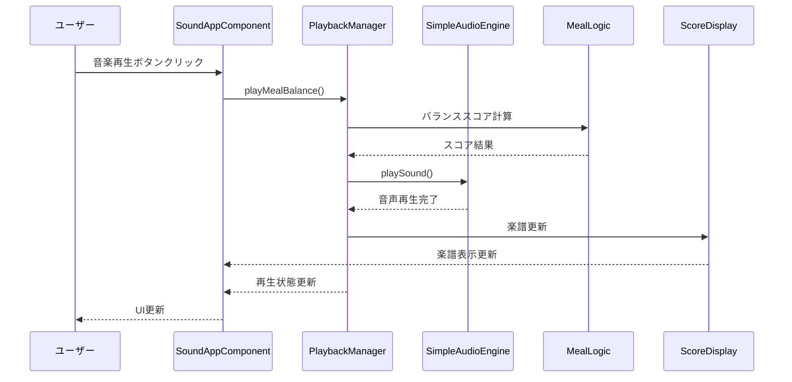
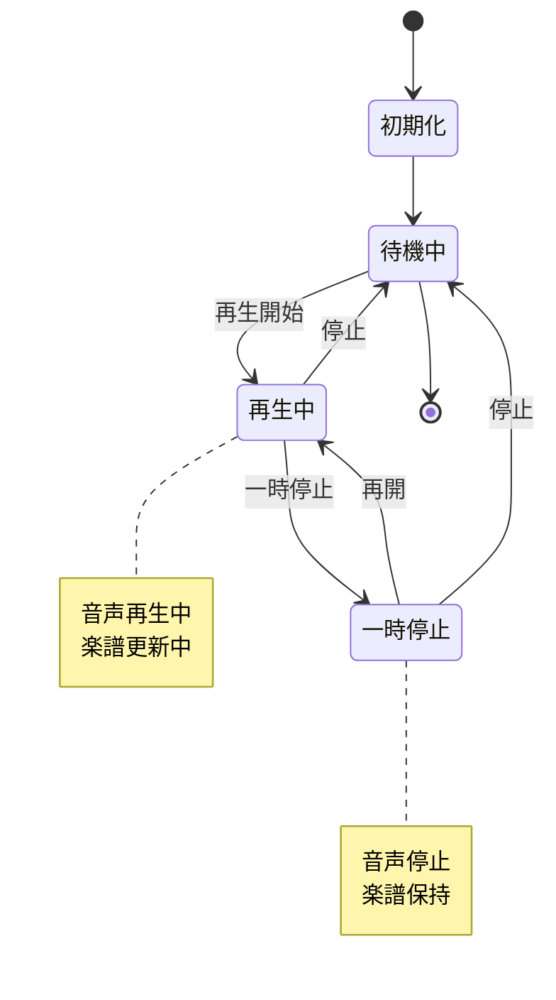
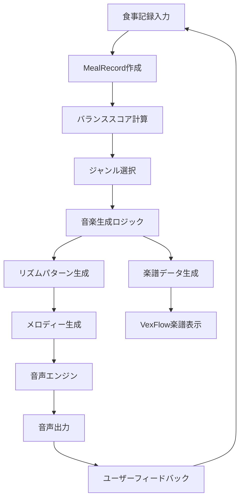
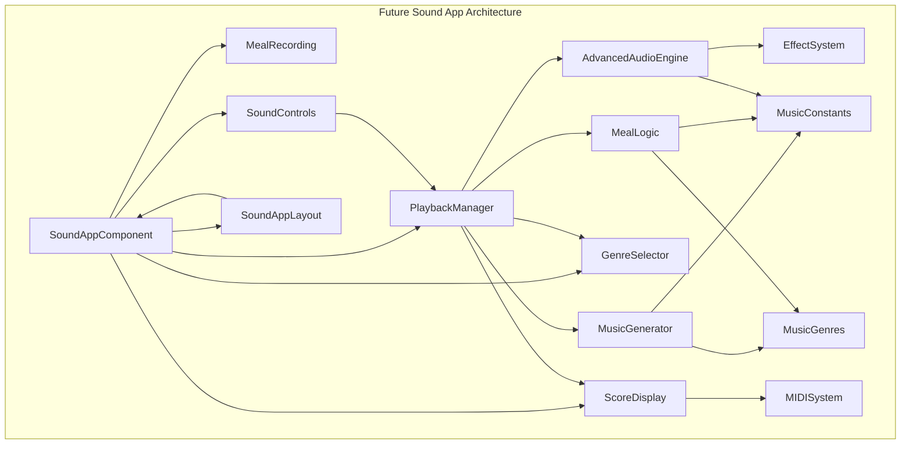

# 音アプリ設計書

## 概要

音アプリは、食事記録に基づいて音楽を自動生成する機能です。ユーザーが記録した食事の内容（主食、副菜、味噌、肉、魚、野菜）に応じて、明和電機風の8bit音楽やその他のジャンルの音楽を生成します。

## 現在の実装状況

### バージョン
- 現在のバージョン: v1.4.0
- 実装状況: Phase 2完了 - 音楽生成ロジックの強化を実装済み

### 技術スタック
- **音声エンジン**: SimpleAudioEngine (ネイティブWeb Audio API)
- **楽譜表示**: VexFlow
- **フロントエンド**: React + TypeScript + Vite
- **状態管理**: React Hooks + Context API

## アーキテクチャ

### コンポーネント構成

```
src/components/sound/
├── SoundAppComponent.tsx      # メインコンポーネント
├── SoundAppLayout.tsx         # レイアウトコンポーネント
├── SoundControls.tsx          # 再生・停止コントロール
├── GenreSelector.tsx          # ジャンル選択
├── MealRecording.tsx          # 食事記録入力
├── ScoreDisplay.tsx           # 楽譜表示
├── PlaybackManager.ts         # 再生管理ロジック（Phase 2対応）
├── SimpleAudioEngine.ts       # 音声エンジン
├── NutritionAnalysis.ts       # 栄養分析システム（新規）
├── DynamicPatternGenerator.ts # 動的パターン生成（新規）
├── GenreFeatureSystem.ts      # ジャンル特徴システム（新規）
├── NutritionAnalysisDisplay.tsx # 栄養分析表示（新規）
├── types.ts                   # 型定義
├── MusicGenres.ts             # 音楽ジャンル定義
├── MusicConstants.ts          # 音楽定数
├── ScoreConstants.ts          # 楽譜定数
├── MealLogic.ts               # 食事ロジック
└── constants.ts               # 共通定数
```

### データフロー



## 主要機能

### 1. 食事記録機能
- **対象カテゴリ**: 主食、副菜、味噌、肉、魚、野菜
- **入力方法**: 数値入力（各カテゴリの量）
- **データ構造**: `MealRecord`インターフェース

```typescript
interface MealRecord {
  id: string;
  date: string;
  categories: { [key: string]: number };
  notes?: string;
}
```

### 2. 音楽生成機能
- **対応ジャンル**: 9種類
  - バランス (120 BPM, C調)
  - 明和電機 (120 BPM, C調) - 8bit風
  - ロック (140 BPM, A調)
  - テクノ (128 BPM, Am調)
  - クラシック (80 BPM, G調)
  - 和楽器 (100 BPM, Dm調)
  - ジャズ (110 BPM, F調)
  - アンビエント (60 BPM, C調)
  - カスタム (120 BPM, C調)

### 3. 音声エンジン (SimpleAudioEngine) - v1.3.0
- **ベース技術**: ネイティブWeb Audio API
- **対応波形**: サイン波、矩形波、ノコギリ波、三角波
- **楽器別音色**: ピアノ、ギター、ドラム、ベース、シンセ、明和電機風
- **エンベロープ**: ADSR（アタック、ディケイ、サステイン、リリース）
- **エフェクト**: リバーブ、ディレイ
- **機能**:
  - 音の再生・停止
  - 音量制御
  - 楽器別リズムパターン生成
  - 和音再生
  - 倍音生成
  - アクティブなオシレーター管理

### 4. 楽譜表示機能
- **ライブラリ**: VexFlow
- **表示内容**: リアルタイム楽譜
- **対応形式**: VexFlow記法

## 現在の問題点

### 1. 音質・音色の問題 ✅ 解決済み
- **以前**: 単純な矩形波のみ
- **現在**: 複数波形、楽器別音色、ADSRエンベロープ、エフェクト対応
- **改善結果**: 豊かな音色表現が可能

### 2. 音楽生成ロジックの簡素化
- **現在**: 固定パターンのリズム生成
- **問題**: 食事内容と音楽の関連性が薄い
- **改善案**: 食事バランスに応じた動的パターン生成

### 3. 楽譜表示の限界
- **現在**: 基本的な音符表示のみ
- **問題**: 複雑なリズムパターンに対応できない
- **改善案**: より詳細な楽譜表示、MIDI対応

### 4. ユーザビリティの問題
- **現在**: 基本的なUIのみ
- **問題**: 直感的でない操作感
- **改善案**: より直感的なUI/UX

## 改善計画

### Phase 1: 音質・音色の向上 ✅ 完了
1. **複数音色の実装** ✅
   - サイン波、三角波、ノコギリ波、矩形波
   - 楽器別の音色（ピアノ、ギター、ドラム、ベース、シンセ、明和電機風）

2. **エフェクト機能** ✅
   - リバーブ、ディレイ
   - エンベロープ（ADSR）

3. **音声合成の改善** ✅
   - より自然な音色生成
   - ハーモニー生成（和音再生）
   - 倍音生成

### Phase 2: 音楽生成ロジックの強化 ✅ 完了
1. **食事バランス分析** ✅
   - 栄養バランススコアの詳細化
   - カテゴリ間の相関関係分析
   - 栄養素別スコア計算
   - バランス分析と推奨事項生成

2. **動的パターン生成** ✅
   - 食事内容に応じたリズムパターン
   - メロディーラインの生成
   - 栄養スコアに基づく複雑さ・エネルギー調整
   - 感情表現の動的生成

3. **ジャンル別の特徴実装** ✅
   - 各ジャンルの特徴的な音色・リズム
   - 楽器編成の最適化
   - 栄養バランスに基づくジャンル推奨
   - エフェクト設定の自動調整

### Phase 3: 楽譜・MIDI機能の強化
1. **楽譜表示の改善**
   - より詳細な楽譜表示
   - リアルタイム更新の最適化

2. **MIDI対応**
   - MIDIファイルの出力
   - 外部MIDIデバイスとの連携

3. **楽曲保存・共有機能**
   - 生成した楽曲の保存
   - 楽曲の共有機能

### Phase 4: UI/UXの改善
1. **直感的な操作**
   - ドラッグ&ドロップでの食事記録
   - リアルタイムプレビュー

2. **視覚的フィードバック**
   - 音の可視化
   - 楽器の視覚的表現

3. **カスタマイズ機能**
   - ユーザー設定の保存
   - テーマ・カラーの変更

## 技術的改善点

### 1. SimpleAudioEngine の拡張 ✅ 実装済み
```typescript
// 以前の実装
class SimpleAudioEngine {
  async playTone(frequency: number, duration: number, volume: number): Promise<void>
}

// 現在の実装
class SimpleAudioEngine {
  async playTone(frequency: number, duration: number, volume: number, instrumentType: InstrumentType): Promise<void>
  async playChord(frequencies: number[], duration: number, volume: number, instrumentType: InstrumentType): Promise<void>
  async playInstrumentRhythm(categoryRatios: any[], beatDuration: number, instrumentType: InstrumentType): Promise<void>
  // ADSRエンベロープ、倍音生成、エフェクト機能も実装済み
}
```

### 2. 音楽生成エンジンの実装
```typescript
interface MusicGenerator {
  generateMelody(categoryRatios: CategoryRatio[], genre: MusicGenre): MelodyPattern[]
  generateRhythm(categoryRatios: CategoryRatio[], genre: MusicGenre): RhythmPattern[]
  generateHarmony(melody: MelodyPattern[], genre: MusicGenre): HarmonyPattern[]
}
```

### 3. 状態管理の改善
```typescript
interface SoundAppState {
  currentMeal: MealRecord
  selectedGenre: MusicGenre
  playbackState: PlaybackState
  audioSettings: AudioSettings
  userPreferences: UserPreferences
}
```

## パフォーマンス最適化

### 1. 音声処理の最適化
- Web Audio APIの効率的な使用
- メモリリークの防止
- 音声バッファの最適化

### 2. レンダリング最適化
- 楽譜表示の仮想化
- 不要な再レンダリングの防止
- メモ化の活用

### 3. バンドルサイズの最適化
- 動的インポートの活用
- 不要な依存関係の削除
- コード分割の実装

## セキュリティ・アクセシビリティ

### 1. セキュリティ
- 音声データの適切な処理
- ユーザー入力の検証
- XSS対策

### 2. アクセシビリティ
- キーボードナビゲーション
- スクリーンリーダー対応
- 色覚異常への配慮

## テスト戦略

### 1. 単体テスト
- 各コンポーネントのテスト
- 音声エンジンのテスト
- 音楽生成ロジックのテスト

### 2. 統合テスト
- エンドツーエンドのテスト
- 音声出力のテスト
- UI操作のテスト

### 3. パフォーマンステスト
- 音声処理のパフォーマンス
- メモリ使用量の監視
- レンダリング性能の測定

## 今後の展望

### 短期目標 (1-2ヶ月) ✅ 完了
- 音質・音色の向上 ✅
- 基本的なエフェクト機能の実装 ✅
- UI/UXの改善（楽器選択UI追加）

### 中期目標 (3-6ヶ月)
- 高度な音楽生成ロジックの実装
- MIDI対応
- 楽曲保存・共有機能

### 長期目標 (6ヶ月以上)
- AIを活用した音楽生成
- リアルタイム協奏機能
- モバイルアプリ化

## まとめ

音アプリはPhase 2の音楽生成ロジック強化により、単純な音声再生から知的な音楽生成アプリへと大幅に進化しました。栄養分析、動的パターン生成、ジャンル特徴システムにより、食事内容と音楽の深い関連性を実現しています。

**Phase 1で実現したこと：**
1. **音質の向上** ✅ - 複数波形、楽器別音色、ADSRエンベロープ、エフェクト
2. **楽器選択UI** ✅ - 直感的な楽器選択インターフェース
3. **和音・倍音生成** ✅ - より豊かな音楽表現

**Phase 2で実現したこと：**
1. **詳細な栄養分析** ✅ - カテゴリ別・栄養素別スコア、相関関係分析
2. **動的パターン生成** ✅ - 食事内容に応じたリズム・メロディー生成
3. **ジャンル特徴システム** ✅ - 栄養バランスに基づく最適なジャンル推奨
4. **栄養分析表示** ✅ - 視覚的なフィードバックと推奨事項

**次のステップ（Phase 3）：**
1. **楽譜・MIDI機能の強化** - より詳細な楽譜表示とMIDI対応
2. **楽曲保存・共有機能** - ユーザー体験の向上
3. **AI活用** - より高度な音楽生成

Phase 2の完了により、「しょぼい」アプリから本格的な知的音楽生成アプリへと進化しました。

## 詳細アーキテクチャ図

### コンポーネント間の関係図


### シーケンス図（音楽再生フロー）


### 状態管理図


### データフロー図（詳細版）


### 改善後のアーキテクチャ図


